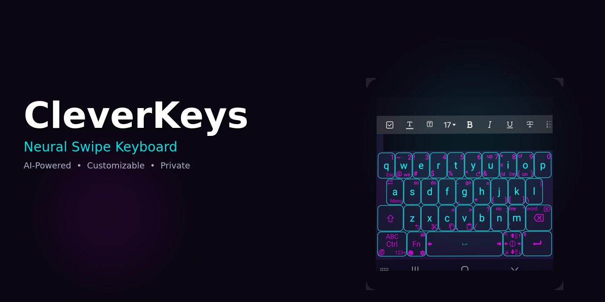
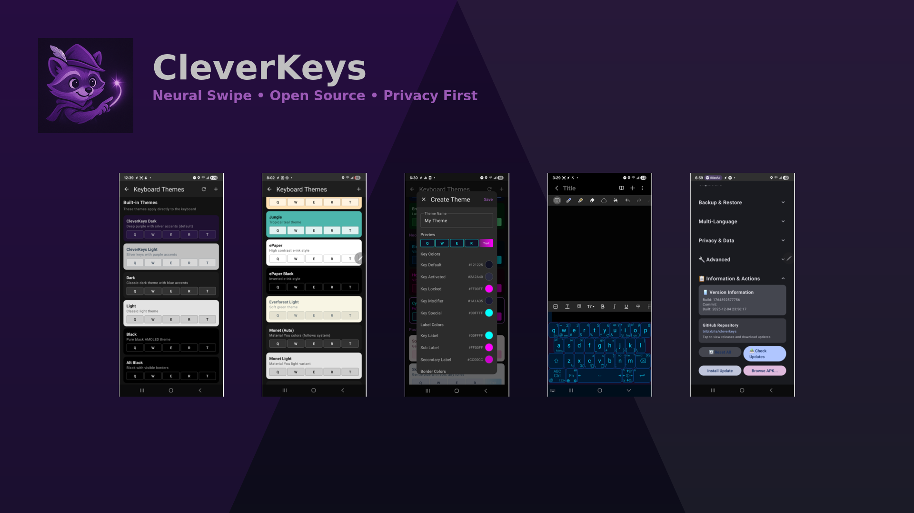
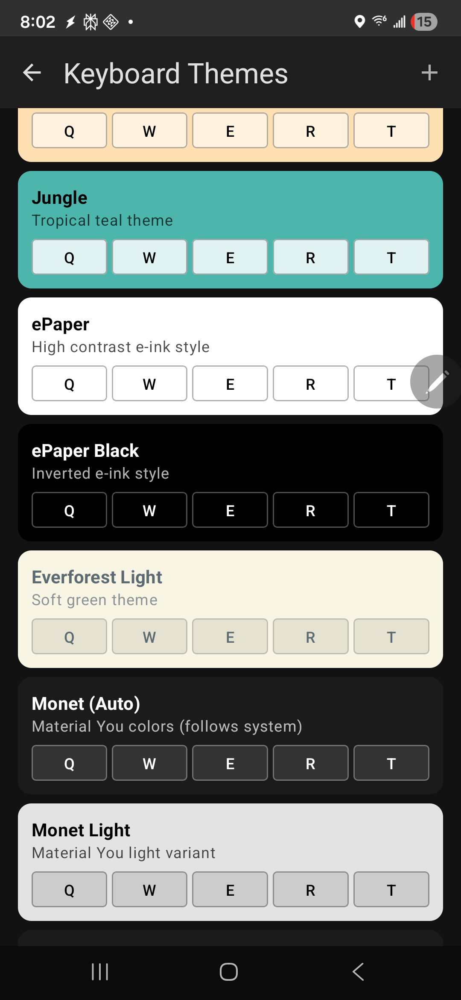
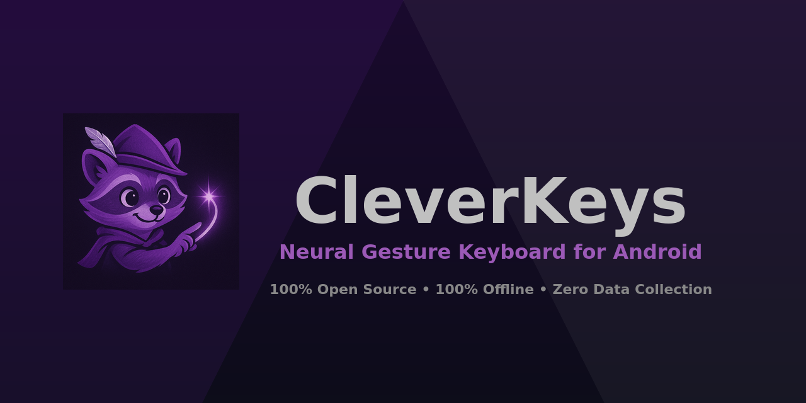

<div align="center">
</br>


# CleverKeys



</div>

</br>

<p align="center">
  </a>
  </a>
  </a>
  </a>
  </br>
  </br>

<a href="https://github.com/tribixbite/CleverKeys/releases">
  
</a>

<a href="https://github.com/tribixbite/CleverKeys/stargazers">
  
</a>

</br>

<a href="https://github.com/tribixbite/CleverKeys/releases/latest">
  
</a>

</br>
</br>

</p>

<div align="center">

# 🗺️ Project Overview

CleverKeys is the only fully open-source neural network gesture keyboard for Android. Featuring an AI-powered swipe engine that runs entirely on-device, unlimited clipboard history, and a powerful theme engine with DIY customization. No proprietary libraries. No cloud dependencies. No data collection.

</div>

<p align="middle">
    
</p>

## What Makes CleverKeys Unique

### Open-Source Gesture Keyboard Comparison

| Feature | CleverKeys | HeliBoard | FUTO | FlorisBoard | AnySoftKeyboard |
|---------|:----------:|:---------:|:----:|:-----------:|:---------------:|
| **Gesture/Swipe Typing** | ✅ Stable | ✅ Stable | ⚠️ Alpha | ⚠️ Disabled⁵ | ⚠️ Experimental |
| **Gesture Engine Open Source** | ✅ | ❌¹ | ✅² | ✅ | ✅ |
| **ML Training Code Public** | ✅ | N/A | ✅⁶ | N/A³ | N/A³ |
| **License** | GPL-3.0 | GPL-3.0 | Source-First² | Apache-2.0 | Apache-2.0 |
| **Internet Permissions** | ❌ None | ❌ None | ❌ None | ❌ None | ❌ None |
| **Gesture Model Type** | Transformer NN | Google Proprietary | Transformer | Algorithmic | Algorithmic |
| **Model Size** | 13MB ONNX | Proprietary Blob | 62MB GGUF | N/A | N/A |
| **Avg. Dict Size** | ~1.2MB (Optimized) | ~3MB | ~1.1MB | N/A | ~1MB |
| **Custom Layouts** | ✅ XML (8 sublabels) | ✅ JSON (flexible) | ✅ YAML (flexible) | ⚠️ JSON (no editor) | ⚠️ Addon packs only |
| **Subkeys Per Key** | 8 (208 total) | ~9/row (popup grid) | 4 corners + hold | 2-5 typical | 5 max popup |
| **DIY Theme Creator** | ✅ | ✅ | ❌ (16 built-in) | ✅ Snygg v2 | ✅ |
| **Clipboard History** | ✅ Unlimited | ⚠️ 10min default⁷ | ✅ 25 items | ✅ 20 items | ❌ 15s hint only |
| **Word Suggestions** | ✅ | ✅ | ✅ | ❌ (v0.6 planned) | ✅ |
| **Gesture Typing in Termux** | ✅ | ⚠️ Corrupted⁴ | ❌ Broken | ⚠️ Disabled | ⚠️ Experimental |
| **Last Release** | Active | Aug 2025 | Dec 2025 | Aug 2025 | Dec 2025 |

<details>
<summary><b>Footnotes & Sources</b></summary>

¹ HeliBoard requires Google's proprietary `libjni_latinimegoogle.so` library for gesture typing ([source](https://github.com/Helium314/HeliBoard#gesture-typing))

² FUTO uses "Source First License 1.1" — source-available but restricts commercial use ([source](https://keyboard.futo.org/))

³ FlorisBoard and AnySoftKeyboard use algorithmic approaches (corner matching, template matching) — no ML training involved

⁴ HeliBoard has a [known bug](https://github.com/termux/termux-app/issues/3941) where swipe typing in Termux produces duplicated/corrupted output

⁵ FlorisBoard glide typing is disabled by default and labeled "alpha quality" — must be enabled manually in advanced settings

⁶ FUTO swipe training dataset is public on [HuggingFace](https://huggingface.co/datasets/futo-org/swipe.futo.org) with training code in their repo

⁷ HeliBoard clipboard retention defaults to 10 minutes but is configurable; items are not persisted across restarts by default

</details>

### Why CleverKeys?

CleverKeys uses a custom **transformer neural network** (encoder-decoder architecture) trained specifically for swipe typing. Unlike algorithmic approaches, neural models learn complex patterns from real swipe data. The model architecture, training code, and datasets are all publicly available at [CleverKeys-ML](https://github.com/tribixbite/CleverKeys-ML) — making it fully reproducible and auditable.

**Key differentiators:**
- **Only keyboard with public ML training pipeline** — verify exactly how the model was trained
- **ONNX format** — cross-platform, hardware-accelerated inference via XNNPACK
- **Sub-200ms predictions** — optimized for mobile with beam search decoding
- **208 customizable short-swipe gestures** — 8 directions × 26 letter keys

### Unlimited Clipboard History
Android restricts clipboard access for security - apps can't read clipboard contents in the background. But keyboards are special. As an Input Method Editor (IME), CleverKeys has legitimate clipboard access, making it the only way to get truly unlimited clipboard history without root.

### 📱 Reliable Swipe Typing in Termux
CleverKeys is the **only open-source keyboard with reliable swipe/gesture typing in Termux**. Other keyboards either disable gestures in terminals (FlorisBoard), produce corrupted output (HeliBoard), or simply don't work (FUTO). Commercial keyboards like Gboard and SwiftKey also disable swipe in Termux. CleverKeys works everywhere — including terminal emulators, SSH sessions, and developer tools.

<div align="center">

# 📲 Download

Go to the [Releases](https://github.com/tribixbite/CleverKeys/releases/latest) and download the latest APK, or click the badge below.

</br>

<p align="middle">
    <a href="https://github.com/tribixbite/CleverKeys/releases/latest"></a>
    <a href="https://apps.obtainium.imranr.dev/redirect?r=obtainium://app/%7B%22id%22%3A%22tribixbite.cleverkeys%22%2C%22url%22%3A%22https%3A%2F%2Fgithub.com%2Ftribixbite%2FCleverKeys%22%2C%22author%22%3A%22tribixbite%22%2C%22name%22%3A%22CleverKeys%22%2C%22preferredApkIndex%22%3A0%2C%22additionalSettings%22%3A%22%7B%5C%22includePrereleases%5C%22%3Afalse%2C%5C%22fallbackToOlderReleases%5C%22%3Atrue%2C%5C%22filterReleaseTitlesByRegEx%5C%22%3A%5C%22%5C%22%2C%5C%22filterReleaseNotesByRegEx%5C%22%3A%5C%22%5C%22%2C%5C%22verifyLatestTag%5C%22%3Afalse%2C%5C%22dontSortReleasesList%5C%22%3Afalse%2C%5C%22useLatestAssetDateAsReleaseDate%5C%22%3Afalse%2C%5C%22trackOnly%5C%22%3Afalse%2C%5C%22versionExtractionRegEx%5C%22%3A%5C%22%5C%22%2C%5C%22matchGroupToUse%5C%22%3A%5C%22%5C%22%2C%5C%22versionDetection%5C%22%3Atrue%2C%5C%22releaseDateAsVersion%5C%22%3Afalse%2C%5C%22useVersionCodeAsOSVersion%5C%22%3Afalse%2C%5C%22apkFilterRegEx%5C%22%3A%5C%22%5C%22%2C%5C%22invertAPKFilter%5C%22%3Afalse%2C%5C%22autoApkFilterByArch%5C%22%3Atrue%2C%5C%22appName%5C%22%3A%5C%22CleverKeys%5C%22%2C%5C%22exemptFromBackgroundUpdates%5C%22%3Afalse%2C%5C%22skipUpdateNotifications%5C%22%3Afalse%2C%5C%22about%5C%22%3A%5C%22Neural%20network%20gesture%20keyboard%20for%20Android%5C%22%7D%22%7D"></a>
</p>

# 🎨 Extensive Theme Engine

</div>

CleverKeys features one of the most powerful keyboard theme engines available:

### Built-in Themes (18+)
- **CleverKeys Dark** — Deep purple with silver accents (default)
- **CleverKeys Light** — Silver keys with purple accents
- **Neon Cyan/Magenta** — Vibrant cyberpunk aesthetic
- **ePaper / ePaper Black** — High contrast e-ink styles
- **Jungle** — Tropical teal theme
- **Everforest Light** — Soft green nature theme
- **Monet (Auto)** — Material You dynamic colors
- **Dark / Light / Black / Alt Black** — Classic options
- And many more...

### DIY Theme Creator
Build your own themes on-the-fly with full control over:
- **Key Colors** — Default, Activated, Locked, Modifier, Special
- **Label Colors** — Primary, Sub-label, Secondary labels
- **Border Colors** — Full border customization
- **Trail Effects** — Swipe trail color and style

<p align="center">
    
    
    
    
</p>

<div align="center">

# ✨ Features

</div>

### 🧠 Neural Network Gesture Recognition
- **Transformer-based encoder-decoder model** (5.4MB encoder + 7.4MB decoder)
- **Sub-200ms predictions** with hardware acceleration (XNNPACK)
- **100% local processing** — works in airplane mode
- **Full inference control** — beam width, length normalization, pruning, early stopping

### 📋 Unlimited Clipboard History
As an IME, CleverKeys has legitimate clipboard access that other apps don't:
- **Unlimited history** (configurable by count or storage size)
- **Pin important items**
- **Search through history**
- **Persistent across reboots**
- **Export/Import for backup**

### 🔒 Privacy First
- **Zero network permissions** — literally cannot phone home
- **No analytics or telemetry**
- **No cloud sync**
- **All processing on-device**
- **Open source = auditable**

### ⚙️ Full Prediction Control
Unlike black-box keyboards, CleverKeys exposes all parameters:
- Beam search tuning (width, length normalization, pruning)
- Autocorrect settings (thresholds, style presets)
- Dictionary control (custom words, frequency adjustments)
- Gesture sensitivity and thresholds

### ⌨️ 100+ Keyboard Layouts
Inherited from Unexpected Keyboard:
- QWERTY, AZERTY, QWERTZ, Dvorak, Colemak
- Programming layouts with special characters
- International layouts for 30+ languages
- Customizable bottom row and modifiers

### 🛠️ Power User Features
- **Terminal mode** — Ctrl/Meta/Fn keys for Termux users
- **Short swipe gestures** — Swipe keys for symbols, navigation, clipboard, and function keys (inherited from Unexpected Keyboard)
- **Backup & Restore** — Export all settings and custom data

<div align="center">

#



# 📚 Tech Stack & Open-source Libraries

</div>

- Minimum SDK level 26 (Android 8.0+)
- [Kotlin](https://kotlinlang.org/) based — 100% Kotlin, zero Java
- [ONNX Runtime](https://onnxruntime.ai/) — Microsoft's cross-platform inference engine
- [Kotlin Coroutines](https://github.com/Kotlin/kotlinx.coroutines) — Asynchronous processing
- [Flow](https://kotlin.github.io/kotlinx.coroutines/kotlinx-coroutines-core/kotlinx.coroutines.flow/) — Reactive data streams
- [Material 3](https://m3.material.io/) — Google's latest design system

<div align="center">

# 🔧 Building from Source

</div>

### Requirements
- Android SDK (API 26+)
- Gradle 8.6+
- Kotlin 1.9.20
- JDK 17

### Commands
```bash
# Clone repository
git clone https://github.com/tribixbite/CleverKeys.git
cd CleverKeys

# Debug build
./gradlew assembleDebug

# Run tests
./gradlew test

# APK location
# build/outputs/apk/debug/cleverkeys.apk
```

### Termux Users
Use the included build script which handles ARM64-specific AAPT2:
```bash
./build-on-termux.sh
```

<div align="center">

# 🧠 The ML Model

</div>

CleverKeys uses a custom transformer neural network model for gesture recognition:

| Component | Details |
|-----------|---------|
| Architecture | Encoder-Decoder Transformer |
| Encoder | Processes swipe trajectories (x, y, velocity, acceleration, nearest keys) |
| Decoder | Generates word predictions from encoded features |
| Format | ONNX (cross-platform, optimized inference) |
| Runtime | ONNX Runtime 1.20.0 with XNNPACK acceleration |
| Total Size | ~13MB (encoder + decoder) |

Training code, model architecture, and datasets: **[CleverKeys-ML](https://github.com/tribixbite/CleverKeys-ML)**

<div align="center">

# ☕ Buy me a coffee

This application is completely free and open source. If you want to support continued development, you can send a donation via the methods below:

| </br>  <br/> <br/> `triQem2gDXHXweNceTKWGfDfN6AnpCHmjR745LXcbix` <br/> <br/> |
|:--------------------------------------------------------------------------------------------------------------------------------------------------------------------------------------:|

</div>

<div align="center">

# ❤️ Credits & Acknowledgments

</div>

### Unexpected Keyboard
CleverKeys began as a fork of [Unexpected Keyboard](https://github.com/Julow/Unexpected-Keyboard) by Jules Aguillon ([@Julow](https://github.com/Julow)). The original is an excellent, highly customizable keyboard with support for 100+ layouts.

Our projects have since diverged significantly (~900 commits apart):
- Complete rewrite from Java to Kotlin
- Addition of gesture typing via custom neural network model
- Clipboard history system
- Different architecture (coroutines, ONNX integration)

If you want a lightweight keyboard without gesture typing, we recommend the original Unexpected Keyboard.

### Neural Network Model Research
- **[Neural Swipe Typing](https://github.com/proshian/neural-swipe-typing)** by [@proshian](https://github.com/proshian) — Initial architecture inspiration
- **[How We Swipe](https://github.com/nicosio2/how-we-swipe)** — Research paper and dataset on swipe behavior
- **[FUTO Swipe Dataset](https://huggingface.co/datasets/nicosio2/FUTO-swipe-dataset)** — Hugging Face dataset

<div align="center">

# ⭐ Star History

<a href="https://star-history.com/#tribixbite/CleverKeys&Date">
 <picture>
   <source media="(prefers-color-scheme: dark)" srcset="https://api.star-history.com/svg?repos=tribixbite/CleverKeys&type=Date&theme=dark" />
   <source media="(prefers-color-scheme: light)" srcset="https://api.star-history.com/svg?repos=tribixbite/CleverKeys&type=Date" />
   
 </picture>
</a>

# 📢 Support

</div>

- **Issues**: [GitHub Issues](https://github.com/tribixbite/CleverKeys/issues)
- **Discussions**: [GitHub Discussions](https://github.com/tribixbite/CleverKeys/discussions)
- **Security**: See [SECURITY.md](SECURITY.md)

<div align="center">

# ⚖️ License

```
CleverKeys - Neural Gesture Keyboard for Android
Copyright (C) 2024-2025 tribixbite

This program is free software: you can redistribute it and/or modify
it under the terms of the GNU General Public License as published by
the Free Software Foundation, either version 3 of the License, or
(at your option) any later version.
```

</br>
</br>

<em>Built with Kotlin, ONNX, and a commitment to privacy.</em><br/>
<em>Developed in Termux on Android.</em><br/><br/>
🦝✨

</div>
